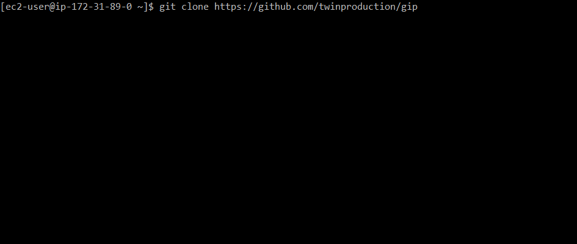

# gip

Get your public IP from the command line.

From the same collection as [show-my-ip](https://github.com/TwinProduction/show-my-ip), a Firefox extension that does just that.




## Usage

Type the following in a command line:

```
gip
```

And as a result, your public IP is returned.


## Installation

You can either use a precompiled binary from the [release](https://github.com/TwinProduction/gip/releases) section, 
or you can build it yourself by doing the following:

```bash
git clone https://github.com/TwinProduction/gip
cd gip
go build
sudo mv gip /usr/local/bin
```


## Custom API URL

Want to use a different API for getting the IP?

No problem, all you have to do is set the **GIP_API_URL** environment variable to the API of your choice.

Here are some APIs you can use:

- http://ip-api.com/line?fields=query
- https://ip.seeip.org
